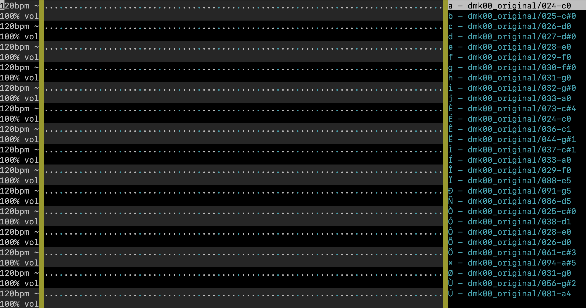

# Terminal Sequencer
With this project we aimed to create an intuitive (drum) sequencer that runs in the terminal.

### How to get started yourself:
#### Clone this Repository
`git clone https://github.com/lucasld/terminal_sequencer.git`
#### Create an Environment
The provided `requirements.txt` file contains all required packages and libraries.
#### Run the sequencer
Start the sequencer by running the `main.py` file.

### The sequencer:
#### Layout
The sequencer consists of a left and right side menu and a grid in the center. Different tracks are arranged vertically. The *left side* menu contains the bpm and volume settings for the individual tracks. The *right side* menu allows to select a sound from the `/sounds` folder.

#### Functions
- each sound is marked by a unique key which can be placed on a track by either typing it or by pressing shift at the desired position
- move the cursor to a position by using the arrow-keys or a click on the terminal
- create loops:
    - close loops by typing "]"
    - open loops by typing "["
    - Place several loops of the same type to create switching loops. The order of "loop-activation" corresponds to the order of placement.
- set "runners" by pressing enter. "Runners" move over the track with the bpm set for the track and play a sound they move over.
- press escape to stop application

#### Configuration
By modifying the `config.yml` file you can configure the sequencer. If you want certain soundfiles to have a certain key see the "sounds" section. Grid parameters like loop-brackets, global-bpm or the runner character can be configured in the "grid" section. Under the "keyboard" section it can be set what keys trigger loop setting. Furthermore there is one global parameter "frame_rate" which allows control of the screen refresh rate. Add sounds by creating a new folder in the `/sounds` folder containing your `.wav`/`.mp3` files.

### Some technical explanations:
#### Grid representation
The grid is represented as a numpy array of shape WIDTH x HEIGHT x CHANNELS
- WIDTH and HEIGHT is the size of the terminal -1
- CHANNELS:
    - channel 0: encodes sequencer properties like note placement, loop placement
    - channel 1: exlusively encodes 'runner' positions. runners are the different 'note exiters' that move one step right each beat (better word for runner?)
    - channel 2: encodes additional information for elements from channel 0, as of yet only order of looper placement
    - channel 3: encodes number of last hit closing loop element
    - channel 4: encodes number of last hit opening loop element
#### Libraries
- numpy: The grid is represented as numpy array. This allows utilisation of performant numpy-functions
- pygame: For sound playing. Pygame is widely adopted and therefore is likely to receive continous support.
- pynput: For keyboard inputs.
- curses: For outputting to the terminal and for mouse inputs
- PyYAML: Reading `config.yml` file

